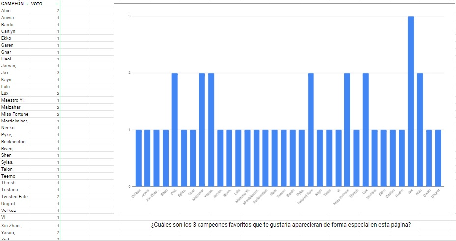
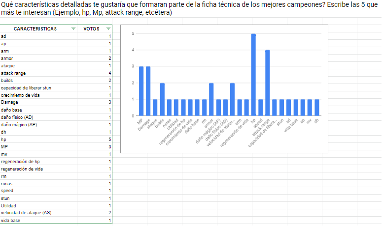
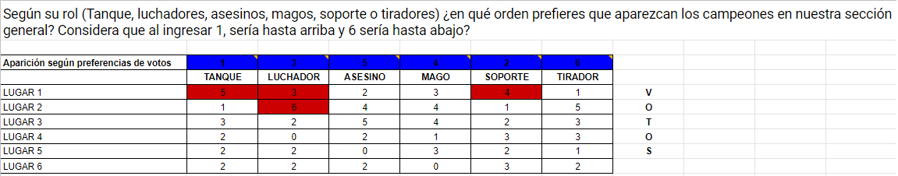
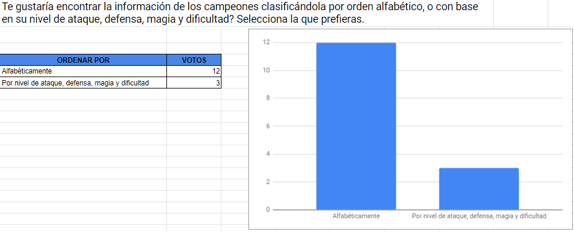
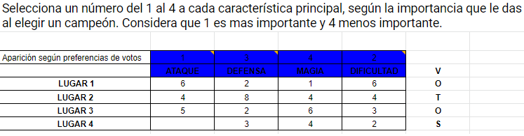
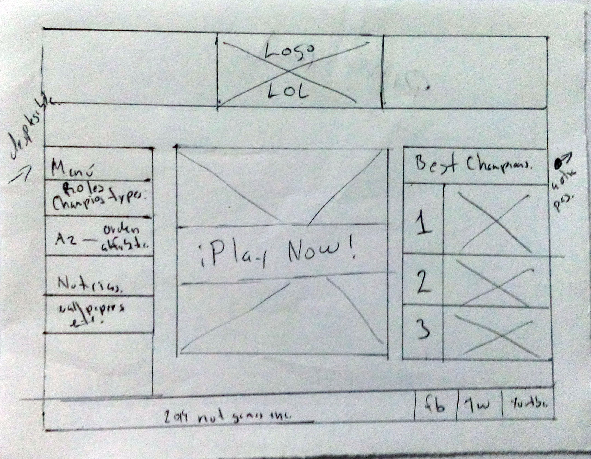
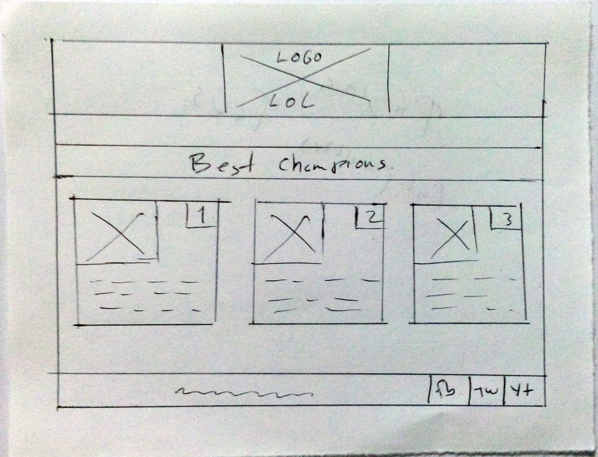
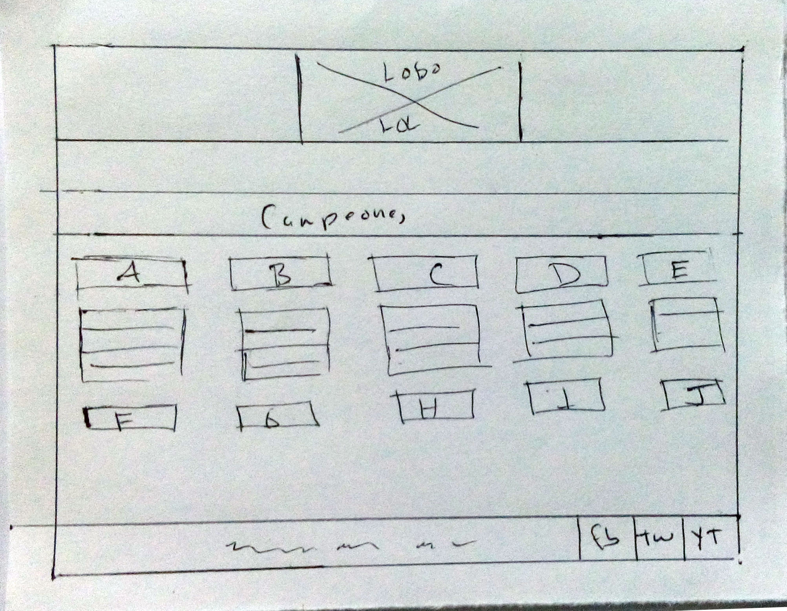
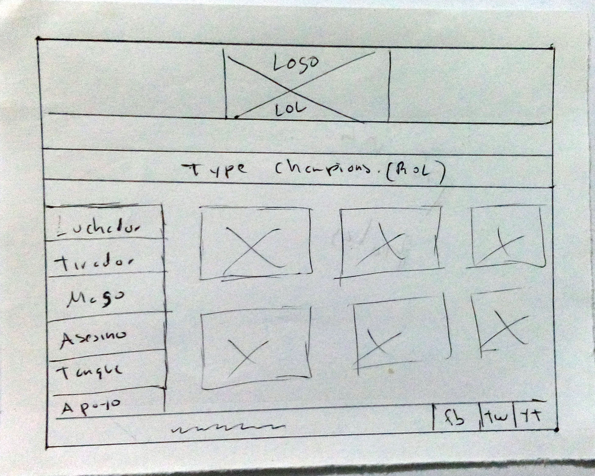

# DATA LOVERS LEAGUE OF LEGENDS

## Órden de temas

- [Investigación inicial](#descubriendo-el-mundo-lol)
- [Definiendo al usuario](#definiendo-al-usuario)
- [Estableciendo el objetivo](#estableciendo-el-objetivo)
- [Cuestionario](#planteando-las-preguntas)
- [Lanzando el cuestionario](#lanzando-el-cuestionario)
- [Obteniendo respuestas](#obteniendo-respuestas)
- [Creando el prototipo](#creando-el-prototipo)
- [Probando el prototipo](#probando-con-test-de-usabilidad)
- [Estableciendo prototipo final](#prototipo-de-alta-fidelidad)

=============================================

## Descubriendo el mundo lol

Al inicio de esta investigación, el equipo de trabajo desconocía de qué trata (_League of Legends_), así como su impacto e importancia en el mundo y las tendencias actuales. 
Nos dimos a la tarea de buscar información que nos explicara a mayor detalle en qué consiste este título, por lo cual, dejamos dos links de las fuentes consultadas que nos parecieron más interesantes, las cuales nos ayudaron a comprender cuáles fueron los inicios de este juego, así como la filosofía de sus creadores para llevarlo, hasta las dimensiones en las que hoy se encuentra.
[Qué es League of Legends](https://www.youtube.com/watch?v=KpxjwIaW0EM)
[¿Por qué League of Legends se ha vuelto tan famoso?](https://www.youtube.com/watch?v=jmGrroicfdM)

Sin duda, es sorprendente saber cómo la visión de 2 jóvenes, nos da muestra de que poner el foco en la Experiencia de Usuario, es clave para el éxito de un producto. 

----------------------------------------------------
## Definiendo al usuario

Si bien, el mundo de los gamers está liderado por jóvenes, existen muchos fans de (_League of Legends_) y otros juegos, que no lo practican de forma profesional y quienes también están interesados en información general de los "campeones", como les llaman.
El usuario de la página que crearemos, no se limita a jugadores profesionales, sino a todo aquel que sienta cierto grado de afición y pasión hacia (_League of Legends_); sin embargo, con base en diversas [lecturas](https://esports.xataka.com/predatoresports/esta-un-joven-de-24-anos-viejo-para-los-esports-a-que-edad-te-retiran-de-la-elite), determinamos que en su mayoría se trata de varones entre los 16 y 44 años de edad, sin importar el país donde se encuentren, ya que en la actualidad existen diversos foros y grupos en redes sociales, que permiten la recepción y envío de información acerca de cualquier tema.

## Estableciendo el objetivo

El objetivo principal de la página está basado en presentar, con base en los requerimientos del usuario, a los (_CAMPEONES_) que ellos consideran los más importantes, así como la información detallada de cada uno de ellos, que consideren más relevante.
También queremos obtener información acerca de los parámetros a los que les dan más importancia, para saber el orden en el cual debemos presentar a toda la gama de (_CAMPEONES_).

## Planteando las preguntas

Para este proceso planteamos 5 preguntas, 2 de las cuales fueron abiertas, pero que nos arrojaran respuestas incluidas en la (_data_), enfocadas a saber los (_CAMPEONES_) favoritos de los usuarios y las característica detalladas que les gustan de ellos. 
Las 3 preguntas siguientes, fueron enfocadas a saber la preferencia de los usuarios por las habilidades de los (_CAMPEONES_); así como el orden que más les agrada para ver a todos los personajes dentro de la página.
La encuesta fue lanzada a través de (_Google Forms_), a través del siguiente [link](https://docs.google.com/forms/d/1dqC0hiNJxchr4kkdNz55PyTgy433cmriPvs0vYNncwI/edit#responses)

## Lanzando el cuestionario

Nos dimos a la tarea de investigar diversos lugares virtuales, a través de los cuales hay interacción de los fans de (_League of Legends_), dentro de los cuales encontramos, [foros en la web](https://boards.las.leagueoflegends.com/es/), [grupos de Facebook](https://web.facebook.com/groups/504633653337738/?multi_permalinks=665713990563036&notif_id=1561652036224897&notif_t=feedback_reaction_generic), [grupos de WhatsApp](http://mx.gruposdewhatsapp.com/league-of-legends_gr_231986). Estos fueron los medios a través de los cuales obtuvimos respuesta a nuestro cuestionario. 

## Obteniendo respuestas
Una vez que obtuvimos las respuestas, las vaciamos en una [hoja de cálculo](https://docs.google.com/spreadsheets/d/1kRUAxB8K72SgsEe1dhc8HJaznY5x7wkA8P6vc4u_ut0/edit?usp=sharing) y algunas fueron graficadas para poder comprenderlas de mejor forma. 

### Pregunta 1

### Pregunta 2

### Pregunta 3

### Pregunta 4

### Pregunta 5

## Creando el prototipo

Con base en las respuestas enviadas a través de los jugadores que encontramos en los diversos tipos de grupos y foros, realizamos un prototipo que presentará:
- Página principal con el menú para que elijan qué información quieren ver, así como un link para que pueda ingresar al juego 
- Página secundaria con los mejores campeones, elegidos por ellos y algunas características detalladas que también determinaron ellos.
- Página secundaria con los campeones por orden alfabetico 
- Página secundaria con los campeones por tipo de rol 

